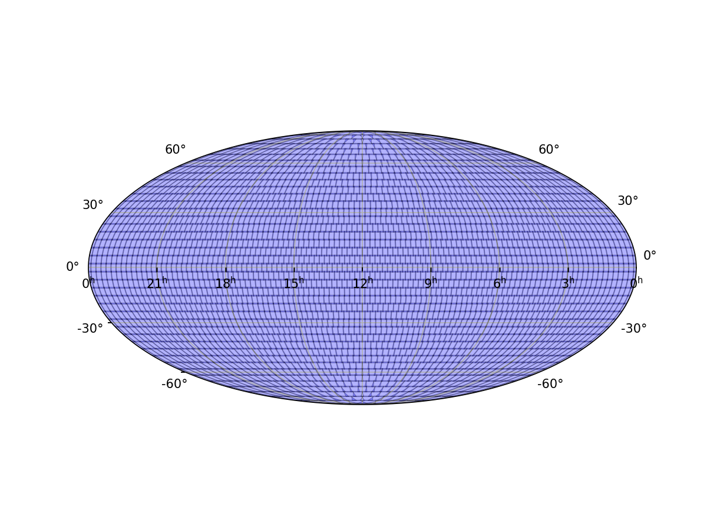
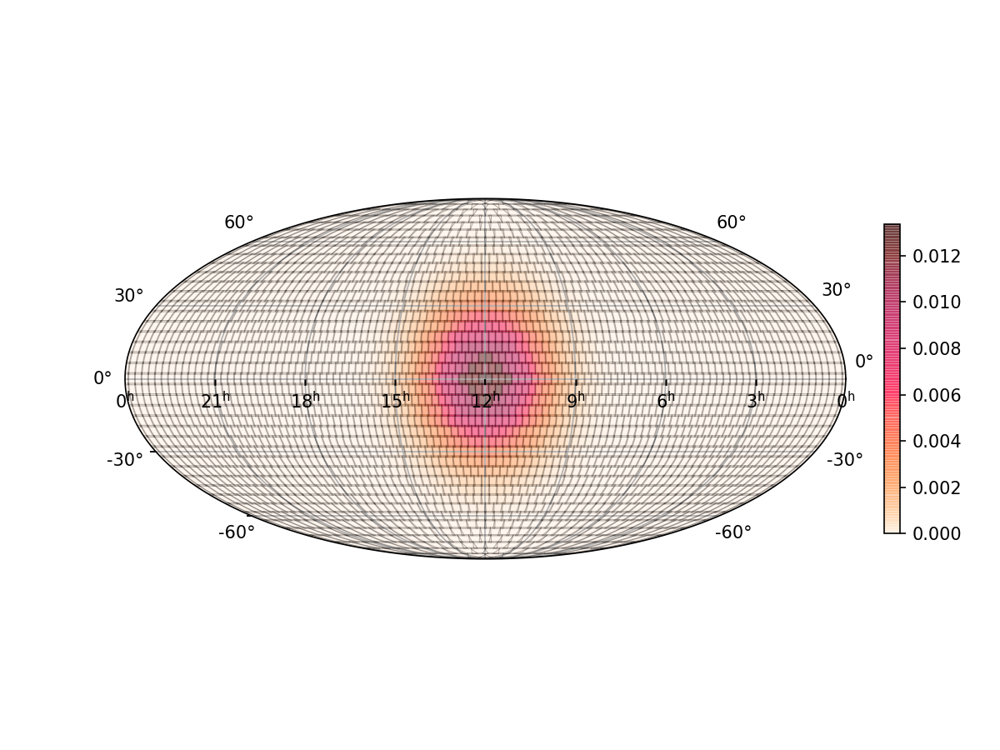
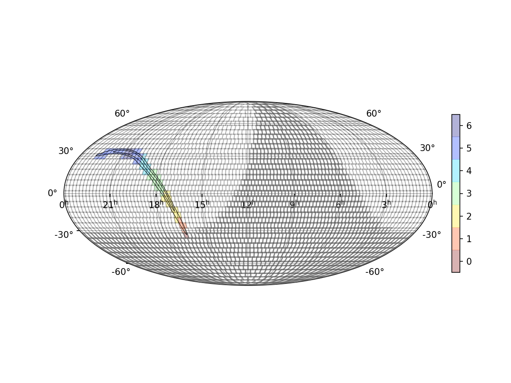

# GOTO-tile

**GOTO-tile** is a skymap processing and sky tiling module for the GOTO Observatory.

Note this module is Python3 only and has been developed for Linux, otherwise use at your own risk.

## Requirements

GOTO-tile requires several Python modules, which should be included during installation.

It should not require any other GOTO-specific modules to be installed.

### Installation

Once you've downloaded or cloned the repository, in the base directory run:

    pip3 install .

You should then be able to import the module using `import gototile` within Python.

The `gototile` scripts should also be added to your path (see below).

## Usage instructions

This package contains several useful classes for handling sky maps (`gototile.skymap`) and all-sky grids (`gototile.grid`). See the `/docs` directory for some useful examples.

### The `gototile` script

The core functions of the package can also be accessed using the `gototile` script, which should be added to your path when the module is installed. Use `gototile -h` to list all options.

At a minimum the script requires a sky grid to be defined. This can be done using the `-g/--grid` flag, which takes 4 parameters: RA field of view, Dec field of view, RA overlap and Dec overlap. Alternatively a pre-defined telescope grid can be selected using the `-t/--telescope` flag, for instance `-t GOTO4` will use the grid used by the GOTO4 prototype telescope. Therefore the bare minimum arguments for the script looks like:

    ~$ gototile -t GOTO4

    Using defined sky grid for GOTO4 prototype (3.7, 4.9, 0.1, 0.1)
    Generated grid containing 2913 tiles
        tilename     ra        dec
    0       T0001    0.0 -90.000000
    1       T0002    0.0 -85.714286
    2       T0003   40.0 -85.714286
    3       T0004   80.0 -85.714286
    4       T0005  120.0 -85.714286
    ...       ...    ...        ...
    2908    T2909  200.0  85.714286
    2909    T2910  240.0  85.714286
    2910    T2911  280.0  85.714286
    2911    T2912  320.0  85.714286
    2912    T2913    0.0  90.000000

    [2913 rows x 3 columns]

On its own that's not very helpful, unless you want a quick reference for the number of tiles in the prototype grid. Two other flags make the script produce some actually useful output:

* `-o/--outfile <FILENAME>` will save the full tile table to a CSV file with the given name. At this stage the only columns will be the three shown in the readout above.

* `-p/--plot <FILENAME>` will create a plot with the given filename. Again at the moment it is fairly boring, just showing the locations of the grid tiles on the sky. The output of `gototile -t GOTO4 -p GOTO4_grid.png` is shown below:

That basic gird output can be useful, but where GOTO-tile shines is in combination with transient event skymaps. There are two ways to use a skymap with the grid. The `-s/--skymap` flag can be used to open a FITS skymap file, either by giving it a local path or a web URL. Alternatively the `-G/--gaussian` flag will tell GOTO-tile to generate a basic skymap with a 3D Gaussian profile, using the given RA, Dec and radius parameters.

For example, the below command defines a Gaussian skymap centred on (180, 0) with a radius of 30 degrees. This is then applied to the GOTO4 grid and the output is saved to a CSV and as a plot. Note the tile table now includes a fourth column, probability (`prob`), the total skymap probability contained within each tile. When a skymap is applied the grid is sorted by probability, you can see that the top two tiles (`T1457` and `T1458`) both contain the most probability (~1.3%) - as you would expect, since they are closest to the peak of the skymap.

    ~$ gototile -t GOTO4 -G 180 0 30 -o out.csv -p GOTO4_gaussian.png
    Using defined sky grid for GOTO4 prototype (3.7, 4.9, 0.1, 0.1)
    Generated grid containing 2913 tiles
    Creating skymap...
    Applying probability skymap to grid...
        tilename          ra       dec          prob
    0       T1457  178.348624  0.000000  1.336924e-02
    1       T1458  181.651376  0.000000  1.336924e-02
    2       T1351  186.666667 -4.285714  1.269648e-02
    3       T1568  186.666667  4.285714  1.269648e-02
    4       T1347  173.333333 -4.285714  1.269648e-02
    ...       ...         ...       ...           ...
    2908    T1295    0.000000 -4.285714  1.246036e-19
    2909    T1512    0.000000  4.285714  1.246036e-19
    2910    T1511  356.697248  0.000000  9.433167e-20
    2911    T1404    3.302752  0.000000  9.433167e-20
    2912    T1403    0.000000  0.000000  4.077151e-20

    [2913 rows x 4 columns]
    Saving table to out.csv
    Saving tile plot to GOTO4_gaussian.png

This is very useful for seeing how a skymap would be applied to a grid, and it replicates what GOTO-tile is used for when a transient alert is received.

However, the `gototile` script can do much more: it also includes the ability to simulate follow-up observations of any skymap it is given. Simulations are run using the `--simulate` flag, and there are a large number of simulation options listed in the script's help text. Some of the key flags are given below:

* `-d/--date <DATE>` gives a date and time to start the simulations from. The datetime string is anything parsable by `astropy.time.Time()`, for instance `"2020-01-01 00:00"` (assumed to be UTC). This can be used to simulate follow-up observations of transient skymaps at the time they would have been received. If not given the default is to start skymaps at the current system time.

* `-D/--duration <DAYS>` gives the length of time to simulate in days. The default is 1, i.e. 24 hours after the start date.

* `-S/--site <NAME>` gives the location on Earth to simulate observations from. The simulations account for day/night times from the given site (the twilight Sun altitude can be altered using the `--twilight` flag), and tiles are weighted and selected based on their local altitude. The site name must be accepted by `astropy.coordinates.EarthLocation.of_site()`, a full list is given by `astropy.coordinates.EarthLocation.get_site_names()`. The default is `lapalma`, which is the ORM on La Palma. NOTE at the moment only one site can be given for each simulation.

* `-m/--mounts <INT>` gives the number of independent mounts at the simulated site. Targets are assigned to mounts by simply taking the X highest priority tiles from the top of the sorted list, where X is the number given here.

* `-C/--source-coords <RA> <DEC>` allows for setting the coordinates of the transient source. This will not affect the simulation (since it won't be known for real transient skymaps), but the number of times the source location was observed will be printed at the end and the coordinates will be marked on the output plot.

* `-c/--contour <PROB>` defines the probability contour level to select tiles from before the simulation starts. The simulation only considers a limited number of tiles when ranking, and the scheduling strategy focuses on getting an initial pass of all visible selected tiles before returning for repeated observations. The default is 0.95, i.e. cutting tiles outside of the 95% probability contour (see also the `--max-tiles` and `--min-prob` options, which are similarly used to cut down the initial selection, if needed).

* `--exptime <SECONDS>` sets the time to spend "observing" each tile. The script runs a fairly simplistic simulation in steps of this value, checking each step which tiles to observe and ticking off any which were selected. The default is 300, i.e. 5 minutes per observation. Note that slew time between targets is not simulated.

* `-v/--verbose` will print out what tiles are being observed at every step in the simulation.

Below is the full output and resulting plot from a simulation of a real LIGO/Virgo gravitational-wave skymap, observing from La Palma with 2 GOTO4 mounts. Note that the simulation is only run for half a day to reduce the number of sunlight hours. With the `-v` verbose flag the tiles selected for observation are printed at each stage, and the number of visible tiles is also given.

    ~$ gototile -t GOTO4 -s https://gracedb.ligo.org/api/superevents/S190521r/files/bayestar.fits.gz --simulate -d "2020-08-01 20:00" -D 0.5 -m 2 -v -p GOTO4_sim.png

    Using defined sky grid for GOTO4 prototype (3.7, 4.9, 0.1, 0.1)
    Generated grid containing 2913 tiles
    Loading skymap...
    Skymap loaded
    Applying probability skymap to grid...
    Selected 59 tiles based on given limits.
    tilename          ra        dec      prob
    0     T2214  298.723404  30.000000  0.043409
    1     T2215  302.553191  30.000000  0.042520
    2     T2308  312.000000  34.285714  0.042204
    3     T1700  269.158879   8.571429  0.041641
    4     T1482  260.917431   0.000000  0.040919
    5     T2309  316.000000  34.285714  0.040226
    6     T2117  290.204082  25.714286  0.036815
    7     T2017  285.148515  21.428571  0.036597
    8     T2307  308.000000  34.285714  0.036528
    9     T1591  263.333333   4.285714  0.035705
    10    T2310  320.000000  34.285714  0.035465
    11    T1264  255.700935  -8.571429  0.035377
    12    T1808  275.094340  12.857143  0.035299
    13    T1914  280.384615  17.142857  0.034505
    14    T1592  266.666667   4.285714  0.034367
    15    T1807  271.698113  12.857143  0.034213
    16    T1373  260.000000  -4.285714  0.033750
    17    T1913  276.923077  17.142857  0.032861
    18    T2118  293.877551  25.714286  0.031172
    19    T2216  306.382979  30.000000  0.030197
    20    T1157  254.716981 -12.857143  0.029656
    21    T2311  324.000000  34.285714  0.028972
    22    T2213  294.893617  30.000000  0.028505
    23    T2016  281.584158  21.428571  0.025066
    24    T1051  252.692308 -17.142857  0.024752
    25    T1372  256.666667  -4.285714  0.024598
    26    T2312  328.000000  34.285714  0.022222
    27    T1699  265.794393   8.571429  0.022163
    28    T1483  264.220183   0.000000  0.021368
    29    T2306  304.000000  34.285714  0.020939
    30    T0947  249.504950 -21.428571  0.018799
    31    T2018  288.712871  21.428571  0.018184
    32    T2116  286.530612  25.714286  0.017895
    33    T1701  272.523364   8.571429  0.017610
    34    T2217  310.212766  30.000000  0.016246
    35    T2313  332.000000  34.285714  0.015340
    36    T1265  259.065421  -8.571429  0.013594
    37    T0847  249.795918 -25.714286  0.013118
    38    T2119  297.551020  25.714286  0.012268
    39    T1156  251.320755 -12.857143  0.011991
    40    T1915  283.846154  17.142857  0.010454
    41    T1809  278.490566  12.857143  0.009468
    42    T1050  249.230769 -17.142857  0.008770
    43    T2314  336.000000  34.285714  0.008730
    44    T1912  273.461538  17.142857  0.008106
    45    T0750  248.936170 -30.000000  0.008011
    46    T2218  314.042553  30.000000  0.007580
    47    T0948  253.069307 -21.428571  0.007430
    48    T1806  268.301887  12.857143  0.007388
    49    T1593  270.000000   4.285714  0.007073
    50    T2212  291.063830  30.000000  0.006749
    51    T1481  257.614679   0.000000  0.006724
    52    T2224  337.021277  30.000000  0.006289
    53    T2225  340.851064  30.000000  0.006005
    54    T0846  246.122449 -25.714286  0.005794
    55    T2305  300.000000  34.285714  0.005309
    56    T0657  248.000000 -34.285714  0.004993
    57    T2223  333.191489  30.000000  0.004801
    58    T1374  263.333333  -4.285714  0.004787
    Total probability covered: 96.00%
    Simulating 0.5 days starting from 2020-08-01 20:00:00.000...
    2020-08-01 20:00:00.000 -   daytime
    2020-08-01 20:05:00.000 -   daytime
    2020-08-01 20:10:00.000 -   daytime
    2020-08-01 20:15:00.000 -   daytime
    2020-08-01 20:20:00.000 -   daytime
    2020-08-01 20:25:00.000 -   daytime
    2020-08-01 20:30:00.000 -   daytime
    2020-08-01 20:35:00.000 -   daytime
    2020-08-01 20:40:00.000 -   daytime
    2020-08-01 20:45:00.000 -   daytime
    2020-08-01 20:50:00.000 -   daytime
    2020-08-01 20:55:00.000 -   daytime
    2020-08-01 21:00:00.000 -   observing ['T2309' 'T2308'] (v=50)
    2020-08-01 21:05:00.000 -   observing ['T2310' 'T0750'] (v=51)
    2020-08-01 21:10:00.000 -   observing ['T2307' 'T0847'] (v=51)
    2020-08-01 21:15:00.000 -   observing ['T2215' 'T0846'] (v=51)
    2020-08-01 21:20:00.000 -   observing ['T2311' 'T0947'] (v=52)
    2020-08-01 21:25:00.000 -   observing ['T2216' 'T2214'] (v=52)
    2020-08-01 21:30:00.000 -   observing ['T1051' 'T2218'] (v=52)
    2020-08-01 21:35:00.000 -   observing ['T2312' 'T0948'] (v=53)
    2020-08-01 21:40:00.000 -   observing ['T1157' 'T1264'] (v=53)
    2020-08-01 21:45:00.000 -   observing ['T2217' 'T1050'] (v=53)
    2020-08-01 21:50:00.000 -   observing ['T1482' 'T1373'] (v=53)
    2020-08-01 21:55:00.000 -   observing ['T2313' 'T1700'] (v=53)
    2020-08-01 22:00:00.000 -   observing ['T1156' 'T2117'] (v=53)
    2020-08-01 22:05:00.000 -   observing ['T2223' 'T1591'] (v=54)
    2020-08-01 22:10:00.000 -   observing ['T2314' 'T1372'] (v=55)
    2020-08-01 22:15:00.000 -   observing ['T1592' 'T2017'] (v=55)
    2020-08-01 22:20:00.000 -   observing ['T2224' 'T1265'] (v=56)
    2020-08-01 22:25:00.000 -   observing ['T1808' 'T2118'] (v=56)
    2020-08-01 22:30:00.000 -   observing ['T1807' 'T1914'] (v=56)
    2020-08-01 22:35:00.000 -   observing ['T2225' 'T1483'] (v=57)
    2020-08-01 22:40:00.000 -   observing ['T1913' 'T2213'] (v=56)
    2020-08-01 22:45:00.000 -   observing ['T2306' 'T1699'] (v=56)
    2020-08-01 22:50:00.000 -   observing ['T1374' 'T1481'] (v=56)
    2020-08-01 22:55:00.000 -   observing ['T2016' 'T1701'] (v=55)
    2020-08-01 23:00:00.000 -   observing ['T2018' 'T2116'] (v=55)
    2020-08-01 23:05:00.000 -   observing ['T1593' 'T2119'] (v=55)
    2020-08-01 23:10:00.000 -   observing ['T1809' 'T1806'] (v=55)
    2020-08-01 23:15:00.000 -   observing ['T1915' 'T1912'] (v=55)
    2020-08-01 23:20:00.000 -   observing ['T2305' 'T2212'] (v=55)
    2020-08-01 23:25:00.000 -   observing ['T1051' 'T0948'] (v=54)
    2020-08-01 23:30:00.000 -   observing ['T1050' 'T1157'] (v=54)
    2020-08-01 23:35:00.000 -   observing ['T1264' 'T1156'] (v=54)
    2020-08-01 23:40:00.000 -   observing ['T1373' 'T1482'] (v=53)
    2020-08-01 23:45:00.000 -   observing ['T1372' 'T1265'] (v=53)
    2020-08-01 23:50:00.000 -   observing ['T1591' 'T1700'] (v=52)
    2020-08-01 23:55:00.000 -   observing ['T1592' 'T1483'] (v=52)
    2020-08-02 00:00:00.000 -   observing ['T2309' 'T2308'] (v=51)
    2020-08-02 00:05:00.000 -   observing ['T1481' 'T1807'] (v=51)
    2020-08-02 00:10:00.000 -   observing ['T1374' 'T1808'] (v=51)
    2020-08-02 00:15:00.000 -   observing ['T1699' 'T2214'] (v=50)
    2020-08-02 00:20:00.000 -   observing ['T2215' 'T2310'] (v=50)
    2020-08-02 00:25:00.000 -   observing ['T1913' 'T1914'] (v=50)
    2020-08-02 00:30:00.000 -   observing ['T2017' 'T2117'] (v=49)
    2020-08-02 00:35:00.000 -   observing ['T1701' 'T2307'] (v=49)
    2020-08-02 00:40:00.000 -   observing ['T1593' 'T2311'] (v=49)
    2020-08-02 00:45:00.000 -   observing ['T2016' 'T2118'] (v=49)
    2020-08-02 00:50:00.000 -   observing ['T1806' 'T2216'] (v=48)
    2020-08-02 00:55:00.000 -   observing ['T2213' 'T2312'] (v=48)
    2020-08-02 01:00:00.000 -   observing ['T1912' 'T1809'] (v=47)
    2020-08-02 01:05:00.000 -   observing ['T2116' 'T2018'] (v=46)
    2020-08-02 01:10:00.000 -   observing ['T1915' 'T2306'] (v=46)
    2020-08-02 01:15:00.000 -   observing ['T2313' 'T2225'] (v=46)
    2020-08-02 01:20:00.000 -   observing ['T2217' 'T2314'] (v=44)
    2020-08-02 01:25:00.000 -   observing ['T2119' 'T2212'] (v=44)
    2020-08-02 01:30:00.000 -   observing ['T2224' 'T2223'] (v=44)
    2020-08-02 01:35:00.000 -   observing ['T2305' 'T2218'] (v=42)
    2020-08-02 01:40:00.000 -   observing ['T1591' 'T1483'] (v=42)
    2020-08-02 01:45:00.000 -   observing ['T1592' 'T1700'] (v=42)
    2020-08-02 01:50:00.000 -   observing ['T1699' 'T1807'] (v=41)
    2020-08-02 01:55:00.000 -   observing ['T1593' 'T1808'] (v=40)
    2020-08-02 02:00:00.000 -   observing ['T1701' 'T1806'] (v=40)
    2020-08-02 02:05:00.000 -   observing ['T1913' 'T1914'] (v=40)
    2020-08-02 02:10:00.000 -   observing ['T2017' 'T1912'] (v=39)
    2020-08-02 02:15:00.000 -   observing ['T2016' 'T1809'] (v=38)
    2020-08-02 02:20:00.000 -   observing ['T2117' 'T2214'] (v=37)
    2020-08-02 02:25:00.000 -   observing ['T2215' 'T2118'] (v=37)
    2020-08-02 02:30:00.000 -   observing ['T1915' 'T2308'] (v=36)
    2020-08-02 02:35:00.000 -   observing ['T2116' 'T2018'] (v=35)
    2020-08-02 02:40:00.000 -   observing ['T2213' 'T2307'] (v=34)
    2020-08-02 02:45:00.000 -   observing ['T2309' 'T2216'] (v=34)
    2020-08-02 02:50:00.000 -   observing ['T2310' 'T2212'] (v=33)
    2020-08-02 02:55:00.000 -   observing ['T2306' 'T2119'] (v=33)
    2020-08-02 03:00:00.000 -   observing ['T2311' 'T2217'] (v=32)
    2020-08-02 03:05:00.000 -   observing ['T2305' 'T2312'] (v=31)
    2020-08-02 03:10:00.000 -   observing ['T2313' 'T2218'] (v=31)
    2020-08-02 03:15:00.000 -   observing ['T2314' 'T2224'] (v=29)
    2020-08-02 03:20:00.000 -   observing ['T2225' 'T2223'] (v=29)
    2020-08-02 03:25:00.000 -   observing ['T1914' 'T2016'] (v=29)
    2020-08-02 03:30:00.000 -   observing ['T2017' 'T1915'] (v=28)
    2020-08-02 03:35:00.000 -   observing ['T2117' 'T2116'] (v=28)
    2020-08-02 03:40:00.000 -   observing ['T2018' 'T2118'] (v=28)
    2020-08-02 03:45:00.000 -   observing ['T2214' 'T2213'] (v=26)
    2020-08-02 03:50:00.000 -   observing ['T2215' 'T2212'] (v=26)
    2020-08-02 03:55:00.000 -   observing ['T2308' 'T2307'] (v=25)
    2020-08-02 04:00:00.000 -   observing ['T2119' 'T2216'] (v=25)
    2020-08-02 04:05:00.000 -   observing ['T2309' 'T2306'] (v=25)
    2020-08-02 04:10:00.000 -   observing ['T2305' 'T2310'] (v=23)
    2020-08-02 04:15:00.000 -   observing ['T2217' 'T2311'] (v=23)
    2020-08-02 04:20:00.000 -   observing ['T2218' 'T2312'] (v=23)
    2020-08-02 04:25:00.000 -   observing ['T2313' 'T2314'] (v=22)
    2020-08-02 04:30:00.000 -   observing ['T2223' 'T2224'] (v=22)
    2020-08-02 04:35:00.000 -   observing ['T2225' 'T2118'] (v=21)
    2020-08-02 04:40:00.000 -   observing ['T2213' 'T2214'] (v=20)
    2020-08-02 04:45:00.000 -   observing ['T2215' 'T2119'] (v=20)
    2020-08-02 04:50:00.000 -   observing ['T2216' 'T2307'] (v=19)
    2020-08-02 04:55:00.000 -   observing ['T2308' 'T2306'] (v=18)
    2020-08-02 05:00:00.000 -   observing ['T2305' 'T2309'] (v=18)
    2020-08-02 05:05:00.000 -   observing ['T2217' 'T2310'] (v=17)
    2020-08-02 05:10:00.000 -   observing ['T2218' 'T2311'] (v=17)
    2020-08-02 05:15:00.000 -   observing ['T2312' 'T2313'] (v=16)
    2020-08-02 05:20:00.000 -   observing ['T2314' 'T2223'] (v=15)
    2020-08-02 05:25:00.000 -   observing ['T2224' 'T2225'] (v=15)
    2020-08-02 05:30:00.000 -   observing ['T2216' 'T2307'] (v=14)
    2020-08-02 05:35:00.000 -   observing ['T2308' 'T2217'] (v=13)
    2020-08-02 05:40:00.000 -   daytime
    2020-08-02 05:45:00.000 -   daytime
    2020-08-02 05:50:00.000 -   daytime
    2020-08-02 05:55:00.000 -   daytime
    2020-08-02 06:00:00.000 -   daytime
    2020-08-02 06:05:00.000 -   daytime
    2020-08-02 06:10:00.000 -   daytime
    2020-08-02 06:15:00.000 -   daytime
    2020-08-02 06:20:00.000 -   daytime
    2020-08-02 06:25:00.000 -   daytime
    2020-08-02 06:30:00.000 -   daytime
    2020-08-02 06:35:00.000 -   daytime
    2020-08-02 06:40:00.000 -   daytime
    2020-08-02 06:45:00.000 -   daytime
    2020-08-02 06:50:00.000 -   daytime
    2020-08-02 06:55:00.000 -   daytime
    2020-08-02 07:00:00.000 -   daytime
    2020-08-02 07:05:00.000 -   daytime
    2020-08-02 07:10:00.000 -   daytime
    2020-08-02 07:15:00.000 -   daytime
    2020-08-02 07:20:00.000 -   daytime
    2020-08-02 07:25:00.000 -   daytime
    2020-08-02 07:30:00.000 -   daytime
    2020-08-02 07:35:00.000 -   daytime
    2020-08-02 07:40:00.000 -   daytime
    2020-08-02 07:45:00.000 -   daytime
    2020-08-02 07:50:00.000 -   daytime
    2020-08-02 07:55:00.000 -   daytime
    2020-08-02 08:00:00.000 -   daytime

    Made 208 observations of 58 tiles
        tilename          ra        dec          prob  selected  nobs
    0       T2217  310.212766  30.000000  1.624631e-02      True     6
    1       T2216  306.382979  30.000000  3.019746e-02      True     6
    2       T2307  308.000000  34.285714  3.652774e-02      True     6
    3       T2308  312.000000  34.285714  4.220411e-02      True     6
    4       T2311  324.000000  34.285714  2.897168e-02      True     5
    ...       ...         ...        ...           ...       ...   ...
    2908    T1928  328.846154  17.142857  1.358473e-07     False     0
    2909    T1927  325.384615  17.142857  4.256213e-08     False     0
    2910    T1926  321.923077  17.142857  9.347208e-09     False     0
    2911    T1925  318.461538  17.142857  1.710665e-09     False     0
    2912    T0001    0.000000 -90.000000  2.061218e-05     False     0

    [2913 rows x 6 columns]

    Saving observation plot to GOTO4_sim.png

In the plot below the selected tiles are coloured by the number of times they were observed. 58 of the 59 selected tiles were observed at least once, the final tile was below the observable horizon (tiles with a darker grey outline were not observable during the given time period).

